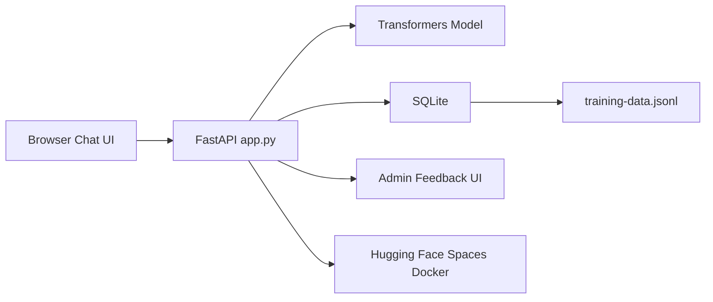
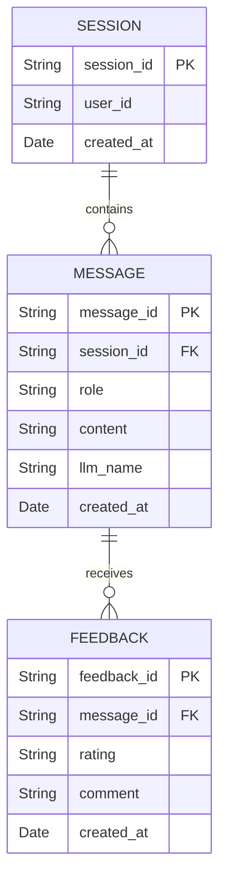

---
title: Personal Korean Chatbot
emoji: 🤖
colorFrom: purple
colorTo: green
sdk: docker
app_port: 7860
pinned: false
license: mit
short_description: FastAPI, SQLite, Feedback 기반 실무형 한글 챗봇
models:
  - Qwen/Qwen2.5-0.5B-Instruct
---

# Personal Korean Chatbot

FastAPI, SQLite, Hugging Face Transformers, Docker를 사용해 만든 한글 챗봇 프로젝트입니다. 브라우저 채팅 UI와 REST API를 제공하고, 대화 히스토리와 사용자 피드백을 저장해 추후 학습 데이터로 export할 수 있게 구성했습니다.

## 1. 프로젝트 개요

- 프로젝트명: Personal Korean Chatbot
- 개발 형태: 개인 배포 프로젝트
- 목적: FastAPI 기반 챗봇 API, SQLite 저장, Hugging Face Spaces Docker 배포 경험 확보
- 현재 배포 기준 실행 파일: `app.py`
- 모델: `Qwen/Qwen2.5-0.5B-Instruct`
- 저장소: https://github.com/woongpro416/korean-chatbot-huggingface-space

## 2. 주요 기능

- 브라우저 기반 채팅 UI
- `POST /chat` 챗봇 응답 API
- SSE 형식의 스트리밍 응답 전송 시도
- 세션별 대화 히스토리 저장/조회
- 사용자 피드백 좋아요/싫어요 저장
- 관리자 피드백 검토 화면
- 긍정 피드백 기반 `training-data.jsonl` export
- SQLite 기반 대화/피드백 저장
- Docker 기반 Hugging Face Spaces 배포

## 3. 담당 역할

- FastAPI 단일 실행 앱 `app.py` 구현
- 브라우저 채팅 UI와 `/chat` API 연결
- SQLite 기반 대화, 메시지, 피드백 저장 흐름 구성
- 관리자 화면과 피드백 조회/export 기능 구현
- Hugging Face Spaces Docker 배포를 위한 `Dockerfile`, `requirements.txt`, README 정리
- 스트리밍 응답 버퍼링 이슈를 확인하고 한계 사항으로 문서화

## 4. 기술 스택

| 영역 | 기술 |
| --- | --- |
| Backend | Python, FastAPI, Pydantic |
| LLM | Hugging Face Transformers, PyTorch, Qwen/Qwen2.5-0.5B-Instruct |
| Database | SQLite |
| Frontend | HTML, CSS, JavaScript served by FastAPI |
| Infra | Docker, Hugging Face Spaces |
| API | REST, SSE StreamingResponse |

## 5. 시스템 아키텍처



## 6. ERD



실제 SQLite table/column은 `app.py`의 초기화 로직 기준입니다. README ERD는 저장 흐름을 설명하기 위한 요약입니다.

## 7. API 명세

| 기능 | Method | Endpoint | 설명 |
| --- | --- | --- | --- |
| Health check | GET | `/health` | 서버 상태 확인 |
| Chat | POST | `/chat` | 사용자 메시지 입력 후 챗봇 응답 반환 |
| History | GET | `/history/{session_id}` | 세션별 대화 기록 조회 |
| Feedback | POST | `/feedback` | 답변 좋아요/싫어요와 코멘트 저장 |
| Admin page | GET | `/admin` | 피드백 검토용 관리자 화면 |
| Admin feedback | GET | `/admin/feedback` | 피드백 목록 API, `X-Admin-Token` 필요 |
| Training export | GET | `/training-data.jsonl` | 긍정 피드백 기반 학습 데이터 export |

Chat 요청 예시:

```json
{
  "session_id": null,
  "user_id": "anonymous",
  "message": "안녕하세요",
  "max_new_tokens": 160,
  "temperature": 0.6,
  "top_p": 0.9
}
```

Feedback 요청 예시:

```json
{
  "message_id": "assistant-message-id",
  "rating": "up",
  "comment": "답변이 자연스러웠습니다."
}
```

## 8. 실행 방법

로컬 실행:

```powershell
python -m venv venv
.\venv\Scripts\activate
pip install -r requirements.txt
python app.py
```

브라우저:

```text
http://localhost:7860
```

API 문서:

```text
http://localhost:7860/docs
```

관리자 화면:

```text
http://localhost:7860/admin
```

기본 관리자 토큰은 `devwoong416`입니다. 실제 배포에서는 Hugging Face Space Settings의 `ADMIN_TOKEN` 환경변수로 관리합니다.

## 9. 테스트 / 검증 방법

- `GET /health`로 서버 상태 확인
- `/docs`에서 OpenAPI 문서와 request/response schema 확인
- 브라우저 채팅 UI에서 메시지 전송 후 응답 표시 확인
- `/history/{session_id}`로 대화 저장 여부 확인
- `/feedback` 호출 후 `/admin/feedback`에서 피드백 조회 확인
- `/training-data.jsonl`에서 긍정 피드백 export 결과 확인
- Hugging Face Spaces의 Live App과 `/docs`에서 배포 상태 확인

## 10. 트러블슈팅

- 현재 Hugging Face Spaces 배포 기준 실행 파일은 `app.py`이며, `Dockerfile`은 `python app.py`를 실행합니다.
- `main.py`, `routers/`, `services/`, `models/`는 이전 분리 구조의 흔적으로 현재 배포 경로에서는 사용하지 않는다고 명시했습니다.
- 서버 로그에서는 모델 응답 chunk가 나뉘어 생성되지만, Spaces 화면에서는 응답이 마지막에 한 번에 표시되는 버퍼링 현상이 남아 있습니다.
- 관리자 토큰은 코드에 고정하지 않고 배포 환경에서는 Space Settings의 환경변수로 관리하도록 정리했습니다.

## 11. 배포 / 링크

- GitHub: https://github.com/woongpro416/korean-chatbot-huggingface-space
- Live App: https://devwoong-mychatbot.hf.space/
- Hugging Face Space: https://huggingface.co/spaces/devwoong/myChatBot
- API Docs: https://devwoong-mychatbot.hf.space/docs

Hugging Face Spaces 배포 절차:

1. Hugging Face에서 새 Space를 만든다.
2. SDK는 Docker를 선택한다.
3. `app.py`, `requirements.txt`, `Dockerfile`, `README.md`, `static/`을 업로드한다.
4. Space Settings에서 `ADMIN_TOKEN` 환경변수를 설정한다.
5. 빌드 완료 후 App 탭과 `/docs`에서 동작을 확인한다.

## 12. 한계와 개선 방향

- 현재 앱은 대화 중 즉시 모델을 학습하지 않습니다.
- SQLite는 포트폴리오와 소규모 시연에는 충분하지만 다중 사용자 운영에는 PostgreSQL 등으로 전환하는 것이 적합합니다.
- 인증은 관리자 토큰 중심으로 단순화되어 있어 실제 서비스 수준의 사용자 인증/권한은 추가가 필요합니다.
- RAG 기반 개인 문서 질의응답, LoRA fine-tuning, 테스트 코드, GitHub Actions CI를 추가하면 실무 완성도를 높일 수 있습니다.